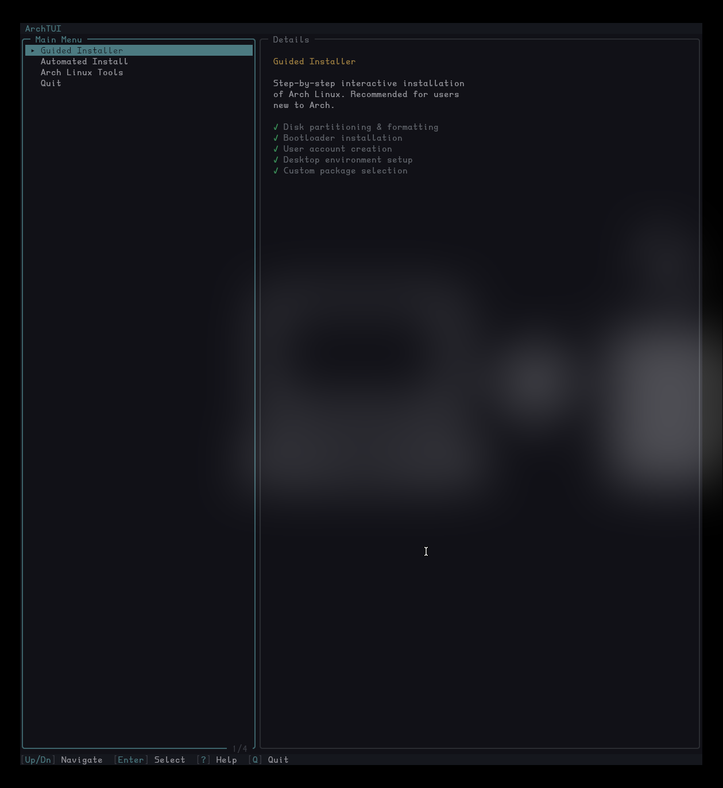
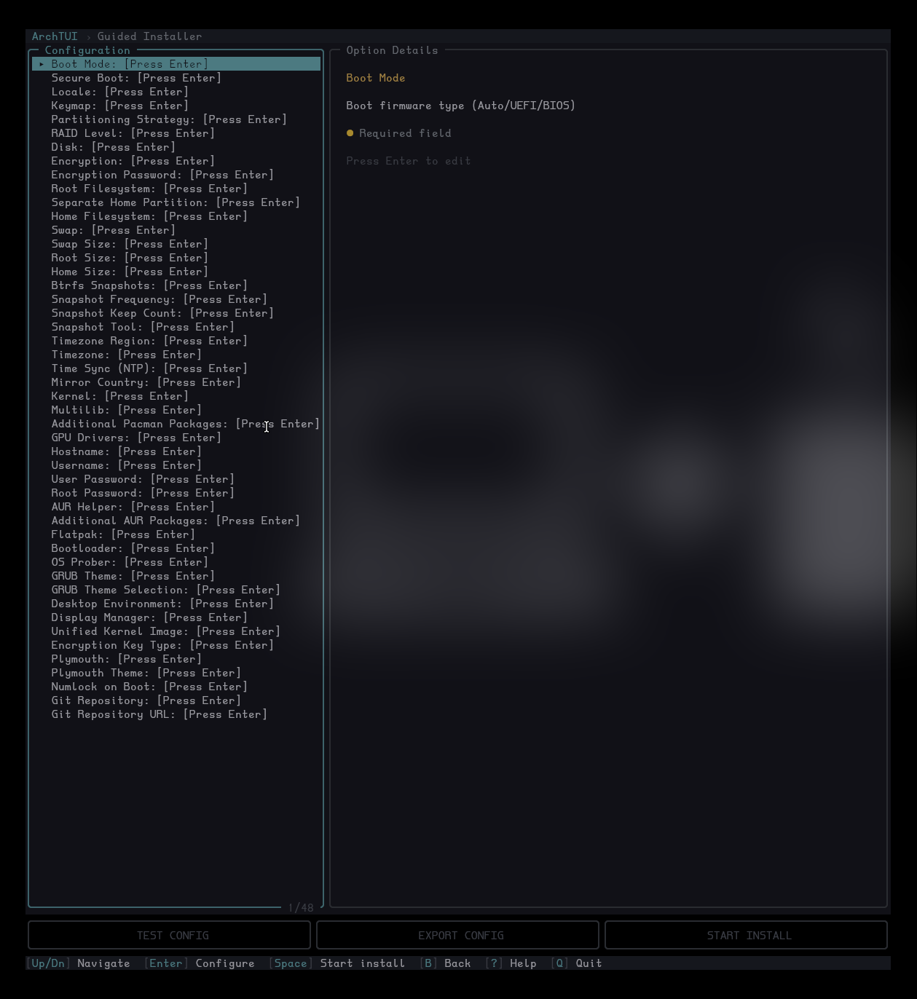
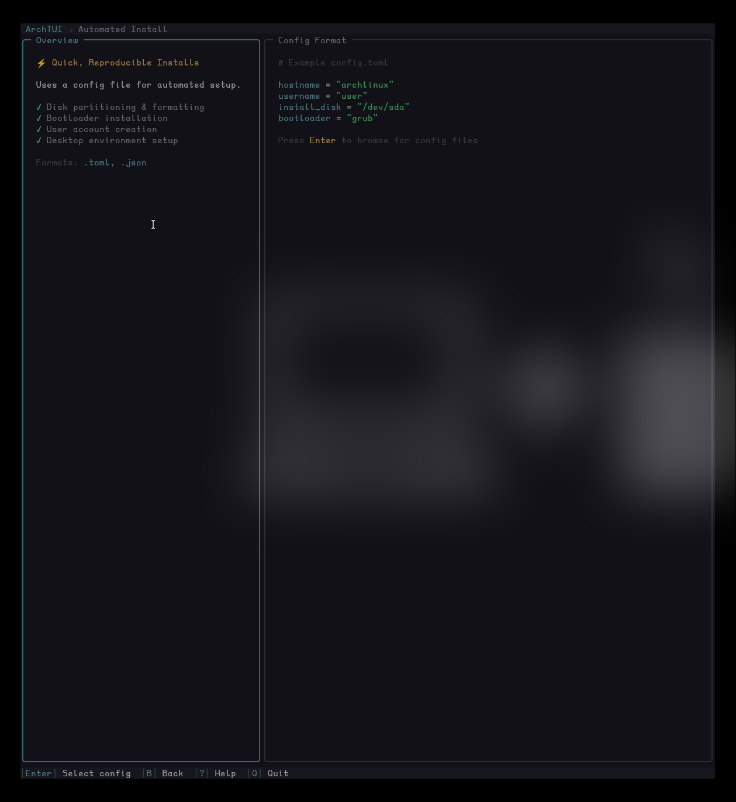
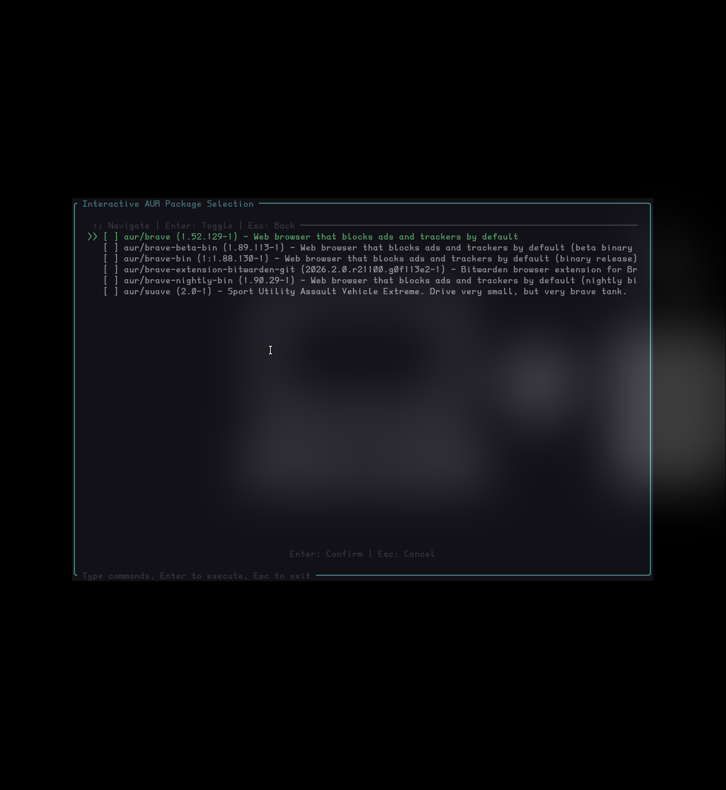
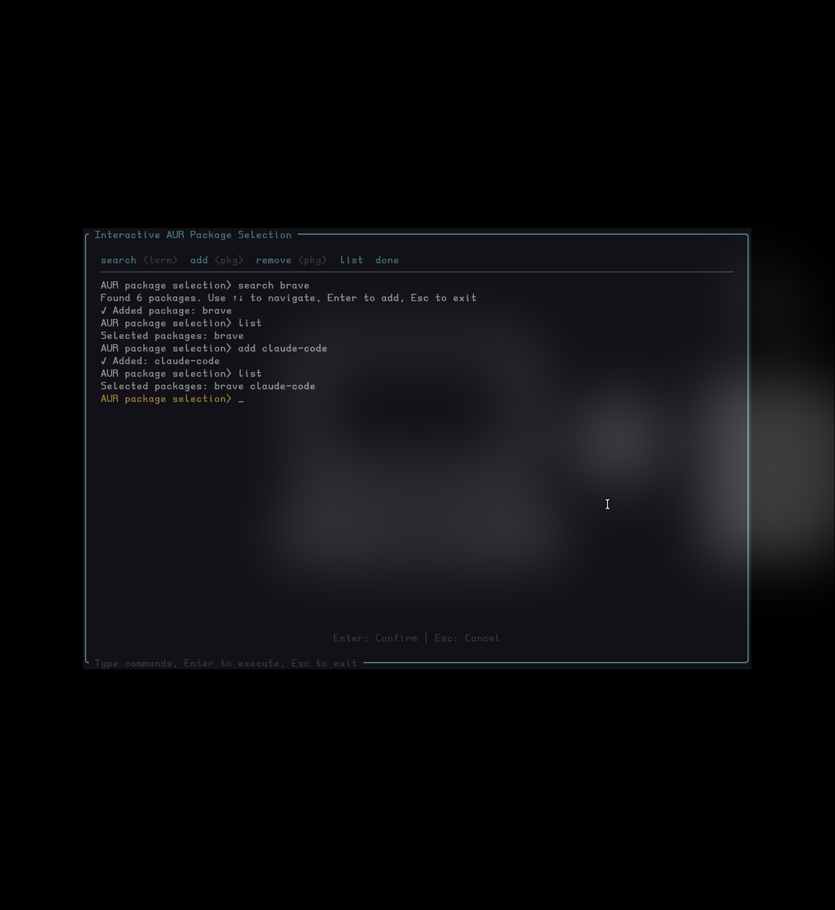
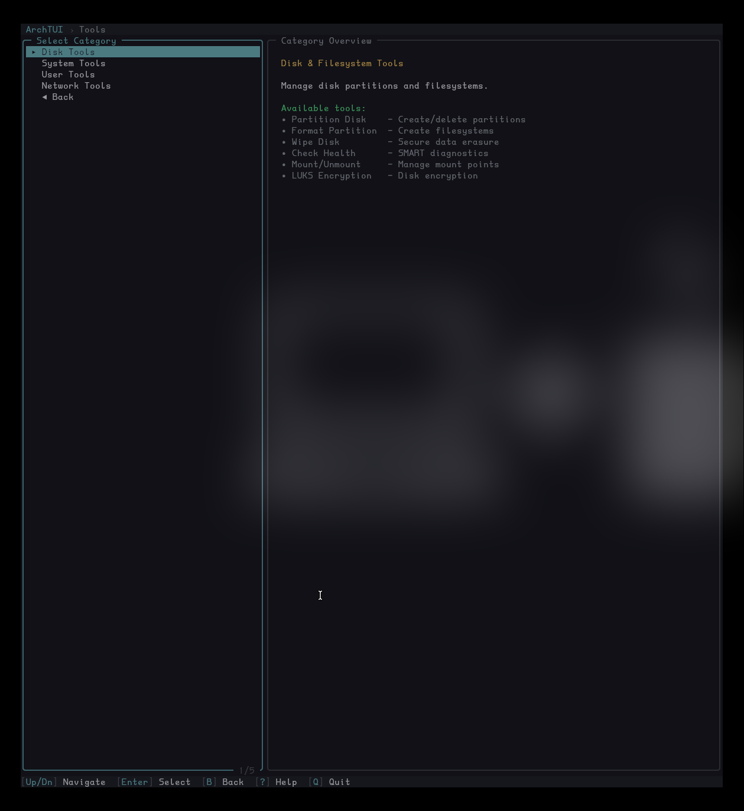

# ArchTUI

A guided installer and system administration toolkit for Arch Linux. The TUI handles configuration, validation, and sequencing. Bash scripts handle execution. The two layers communicate through typed argument structs and environment contracts — Rust decides what to do, Bash does it.

**This is not a replacement for reading the Arch Wiki or understanding how a manual installation works. If you have never installed Arch manually, do that first. The point of the manual install is to understand how the system works.**

**Test in a disposable environment before deploying to systems you care about!**

---

## What it does

**Guided installation** — walks through disk partitioning, filesystem creation, base system install, bootloader setup, user creation, locale/timezone, desktop environment selection, and package installation. Configuration options cascade automatically (e.g. selecting a desktop environment sets an appropriate display manager, disabling encryption clears the encryption password and key type). Supports automated runs from a saved JSON configuration file.

**System tools** — 28 standalone administration scripts accessible from the TUI or directly via CLI. Disk operations, service management, user/group administration, network configuration, security auditing, initramfs rebuilding, and install log viewing.

---

## Screenshots

**Main Menu**


**Guided Installer** — 48 configuration options with cascading defaults


**Automated Install** — config format preview for headless installs


**AUR Search** — live search with version numbers


**AUR Package Selection** — search, select, queue, review


**Disk Tools** — 28 system administration tools accessible from TUI or CLI


---

## Quick start

The Arch live ISO cannot build from source — the Rust toolchain exceeds available ISO memory. Clone and download the pre-built binary:

```
git clone https://github.com/live4thamuzik/ArchTUI.git
cd ArchTUI
./setup.sh
./archtui
```

`setup.sh` downloads the latest release binary and verifies its SHA256 checksum.

### Manual download (if you prefer not to run the script)

```
git clone https://github.com/live4thamuzik/ArchTUI.git
cd ArchTUI
curl -fsSL -o archtui https://github.com/live4thamuzik/ArchTUI/releases/latest/download/archtui
curl -fsSL -o archtui.sha256 https://github.com/live4thamuzik/ArchTUI/releases/latest/download/archtui.sha256
sha256sum -c archtui.sha256
chmod +x archtui
./archtui
```

### Build from source

Requires the Rust toolchain (1.74+). On a full Arch system:

```
cargo build --release
cp target/release/archtui ./
```

Or use `make build`.

---

## Usage

### TUI mode (default)

```
./archtui
```

Launches the interactive terminal interface. Navigate with arrow keys, Enter to select, Esc to go back, Q to quit.

### Automated install from config

```
./archtui install --config config.json
```

Runs a headless installation using a previously saved configuration file.

### Save config without installing

```
./archtui install --save-config config.json
```

Walk through the TUI, configure everything, then write the result to a JSON file for later use or review.

### Export Config (TUI)

From the Guided Installer screen, the Export Config button writes the current configuration to a JSON file. This lets you snapshot your settings at any point during configuration.

### Validate a config file

```
./archtui validate config.json
```

Check a configuration file for errors without running anything.

### Dry-run mode

```
./archtui --dry-run install --config config.json
./archtui --dry-run tools disk wipe --device /dev/sda --method quick --confirm
```

Preview what would be executed. Destructive operations are skipped and logged. Non-destructive operations (health checks, system info) still run.

### Verbose logging

```
./archtui --verbose install --config config.json
ARCHTUI_LOG_LEVEL=trace ./archtui install --config config.json
```

`--verbose` enables detailed trace logging. The `ARCHTUI_LOG_LEVEL` environment variable provides finer control (`error`, `warn`, `info`, `debug`, `trace`). Logs include a master log file, per-script verbose traces, and a configuration dump.

### CLI tools

```
./archtui tools disk format --device /dev/sda1 --filesystem ext4
./archtui tools disk health --device /dev/sda
./archtui tools disk wipe --device /dev/sda --method secure --confirm
./archtui tools system services --action status --service sshd
./archtui tools system info --detailed
./archtui tools user add --username admin --groups wheel,video
./archtui tools user security --action full
./archtui tools network test --action full
./archtui tools network firewall --action status
```

Run `./archtui tools --help` for the full list. Each subcommand has its own `--help`.

---

## Partitioning strategies

| Strategy | Encryption | RAID | LVM | Description |
|---|---|---|---|---|
| Simple | No | No | No | Single disk, EFI + root |
| Simple + LUKS | Yes | No | No | Single disk, encrypted root |
| LVM | No | No | Yes | Logical volume management |
| LVM + LUKS | Yes | No | Yes | Encrypted LVM |
| RAID | No | Yes | No | Software RAID (mdadm) |
| RAID + LUKS | Yes | Yes | No | Encrypted RAID |
| RAID + LVM | No | Yes | Yes | RAID with LVM on top |
| RAID + LVM + LUKS | Yes | Yes | Yes | Full stack |
| Manual | User choice | User choice | User choice | Guided manual partitioning via cfdisk |
| Pre-mounted | N/A | N/A | N/A | Use already-mounted filesystems at /mnt |

All automated strategies create an EFI System Partition and an XBOOTLDR partition. RAID strategies require 2+ disks and support RAID level selection (0, 1, 5, 6, 10).

## Supported options

**Filesystems:** ext4, xfs, btrfs (with optional snapshot management via snapper — configurable frequency, keep count, and snapper assistant), f2fs (flash-friendly for SSDs/NVMe)

**Bootloaders:** GRUB (UEFI and BIOS, with theme selection: PolyDark, CyberEXS, CyberPunk, HyperFluent), systemd-boot (UEFI only), rEFInd (UEFI only), Limine (UEFI and BIOS), EFISTUB (UEFI only, direct kernel boot via efibootmgr)

**Kernels:** linux, linux-lts, linux-zen, linux-hardened

**Desktop environments:** GNOME, KDE Plasma, Hyprland, Sway, i3, Xfce, Cinnamon, Mate, Budgie, Cosmic, Deepin, LXDE, LXQt, bspwm, awesome, qtile, river, niri, labwc, xmonad, or none

**Display managers:** GDM, SDDM, LightDM, LXDM, Ly, greetd (with tuigreet), or none (auto-selected based on DE, user-overridable)

**AUR helpers:** paru, yay, pikaur, or none

**GPU drivers:** auto-detect, NVIDIA (proprietary), NVIDIA Open, AMD, Intel, Nouveau, or none

**Partition sizing:** configurable root and home partition sizes (GB/MB/TB or "Remaining" to use all available space)

**Swap:** optional, configurable size (explicit value, "Equal to RAM", or "Double RAM")

**Encryption:** LUKS2 encryption with secure password handling (tmpfs-backed SecretFile, RAII wipe, inline env vars — never written to disk). Encryption key types: Password, FIDO2 hardware key, or Password+FIDO2

**Plymouth:** optional boot splash with theme selection (bgrt, spinner, fade-in, glow, solar, script, spinfinity, tribar, arch-glow, arch-mac-style)

**Secure Boot:** optional, via sbctl. Keys are created and EFI binaries are signed during installation. A pacman hook automatically re-signs kernels on updates.

---

## Secure Boot setup

Secure Boot key enrollment cannot be completed during installation — it requires a reboot into the installed system first. The installer creates `/root/enroll-secure-boot-keys.sh` and displays post-install instructions on the completion screen.

1. **Keep Secure Boot OFF** and reboot into the new Arch install
2. Run `sudo /root/enroll-secure-boot-keys.sh`
3. If the script reports Setup Mode is not active: reboot to UEFI firmware settings, find Secure Boot options, and clear/reset the Secure Boot keys (this enables Setup Mode). Boot back into Arch and run the script again
4. Once keys are enrolled: reboot to UEFI firmware settings and **enable Secure Boot**
5. Boot normally — Secure Boot is now active with your custom keys

Kernel and bootloader updates are automatically re-signed by a pacman hook (`/etc/pacman.d/hooks/95-secureboot.hook`). No manual action is needed after initial setup.

---

## Architecture

```
archtui (Rust)
  |
  |-- TUI: ratatui + crossterm
  |-- CLI: clap
  |-- Config: serde_json
  |-- Process management: nix, signal-hook
  |-- Package queries: alpm (default, Arch-only)
  |
  v
scripts/ (Bash)
  |-- install.sh              Main installation orchestrator
  |-- chroot_config.sh        Chroot configuration (DEs, DMs, bootloaders, services)
  |-- config_loader.sh        JSON config → environment variables
  |-- strategies/*.sh         10 partitioning strategies
  |-- tools/*.sh              28 system administration tools
  |-- utils.sh, disk_utils.sh Common utilities
```

Rust owns all state, validation, and sequencing. Bash scripts are stateless executors — they receive typed arguments and environment variables, do the work, and exit. Scripts refuse to run without their expected environment contracts.

### Process safety

All child processes are spawned in isolated process groups. If the TUI exits for any reason — including a crash or SIGKILL — child processes are terminated via `PR_SET_PDEATHSIG`. The TUI registers a global child process registry, handles SIGINT/SIGTERM/SIGHUP, and sends group-wide signals to clean up entire process trees. No orphaned `sgdisk`, `cryptsetup`, or `mkfs` processes.

### Script argument system

Each bash script has a corresponding Rust struct implementing `ScriptArgs`. The struct produces CLI arguments, environment variables, and a script path at compile time. This prevents flag typos, enforces required parameters, and integrates with the dry-run system through an `is_destructive()` marker.

### Destructive operation policy

Destructive operations (disk wipe, format, partition, LUKS setup) require:
- Explicit confirmation flags in environment variables
- Validation before execution
- `log_cmd` before any write operation
- Dry-run mode support

---

## Project structure

```
ArchTUI/
|-- src/                    Rust source
|   |-- app/                Application state machine (mod.rs + state.rs)
|   |-- ui/                 TUI rendering
|   |-- components/         Reusable UI components (PTY terminal, dialogs, file browser)
|   |-- scripts/            Typed argument structs for each script category
|   |-- logic/              Pre/post-install orchestration, dependency resolution
|   |-- engine/             Storage abstraction
|   |-- main.rs             Entry point and CLI routing
|   |-- process_guard.rs    Death pact and child process management
|   |-- script_traits.rs    ScriptArgs trait, dry-run mode
|   |-- hardware.rs         Firmware and network detection
|   |-- config.rs           Runtime configuration state
|   |-- config_file.rs      JSON config save/load
|   |-- types.rs            Enums for filesystems, partitions, bootloaders, etc.
|   |-- installer.rs        Installation workflow
|
|-- scripts/
|   |-- install.sh          Main install orchestrator
|   |-- chroot_config.sh    Chroot configuration (all DEs, DMs, services)
|   |-- config_loader.sh    JSON config → env vars
|   |-- strategies/         Partitioning strategy scripts (10)
|   |-- tools/              System administration scripts (28)
|
|-- docs/                   Architecture, safety model, process safety documentation
|-- .github/workflows/      CI: shellcheck + cargo clippy + cargo test + cargo build
|-- Cargo.toml
|-- Makefile                Development build targets
```

---

## Building and development

Requires the Rust toolchain (1.74+). On Arch: `sudo pacman -S rust`

```
make build          # Release build, copies binary to ./archtui
make test           # Run Rust and Bash test suites
make lint           # Clippy + shellcheck on all scripts (must pass before every commit)
make format         # rustfmt
make dev            # format + lint + test + build
make generate       # Generate man page and shell completions (output in dist/)
make install        # Install binary, scripts, man page, and completions
make clean          # Remove build artifacts
```

Release binaries are built by CI in an Arch Linux container and published to GitHub releases with SHA256 checksums.

ALPM (libalpm) is enabled by default for native pacman database queries. Non-Arch build environments can disable it with `--no-default-features`.

### Packaging

`make install` installs to a standard FHS layout with `DESTDIR` and `PREFIX` support:

```
make install PREFIX=/usr DESTDIR=/tmp/pkg
```

This installs the binary to `$PREFIX/bin/`, scripts to `$PREFIX/share/archtui/scripts/`, man page to `$PREFIX/share/man/man1/`, and shell completions for bash/zsh/fish. The `ARCHTUI_SCRIPTS_DIR` environment variable overrides script discovery at runtime. Log output defaults to `/var/log/archtui/` (root) or `~/.local/state/archtui/` (non-root), overridable with `ARCHTUI_LOG_DIR`.

### Runtime dependencies

The binary is dynamically linked against glibc, built on Arch Linux. The bash scripts expect standard Arch Linux utilities: `pacman`, `sgdisk`, `mkfs.*`, `cryptsetup`, `mdadm`, `arch-chroot`, etc. — all present on the Arch live ISO.

---

## Current status

- TUI framework, navigation, menus, dialogs, embedded PTY terminal
- Full CLI with subcommands for all 28 tools
- Typed argument system for all script categories
- Process safety (death pact, group signaling, signal handling)
- Dry-run mode
- JSON configuration save/load/validate/export
- Cascading configuration (dependent options auto-update when parent options change)
- Hardware detection (firmware mode, network state)
- Pre-install orchestration (mirror ranking with network awareness)
- Post-install orchestration (AUR helper, dotfiles — non-fatal)
- Comprehensive logging (master log, per-script verbose trace, config dump, `log_cmd` before all destructive ops)
- Snapshot management (snapper or timeshift) with configurable frequency and retention
- 524 tests (338 Rust + 186 BATS)
- CI pipeline (shellcheck + BATS + cargo clippy + cargo test + cargo audit + safety linter)


